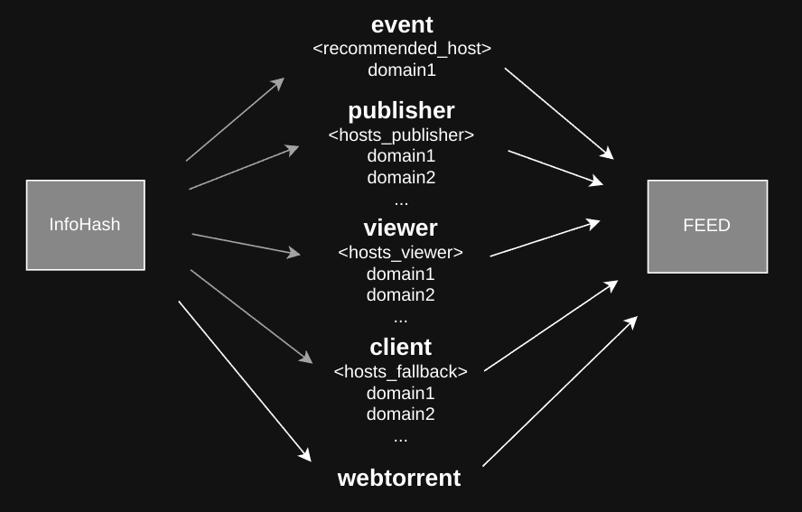

Info Hashes
-----------

# Table of Contents

1. [Overview](#overview)
1. [NIPs](#nips)
1. [Naming convention](#naming-convention)
    * [Why Infohashes?](#why-infohashes)
1. [Infohash](#infohash)
    * [Torrent file piece length](#torrent-file-piece-length)
    * [Torrent file name](#torrent-file-name)
    * [Media files metadata](#media-files-metadata)
1. [Event](#event)
    * [Upload a media file](#upload-a-media-file)
    * [Reference an infohash event](#reference-an-infohash-event)
1. [Default hosts](#default-hosts)
    * [Timestamp](#timestamp)
1. [Hosts](#hosts)
    * [Find a host with a media file](#find-a-host-with-a-media-file)
    * [Why hosts_viewer are needed?](#why-hosts_viewer-are-needed)
1. [Other notes](#other-notes)
    * [Custom previews](#custom-previews)
    * [Why no IPFS support?](#why-no-ipfs-support)
1. [Feedback](#feedback)

`draft` `optional` `author:lovvtide(Stuart Bowman)` `author:degenrocket`

## Overview

At the time of writing, a Nostr protocol has limitations that stop developers from implementing a user-friendly and censorship-resistant way of sharing media files such as audio, video, and images.

This documentation describes the process of distributing media files using infohashes as identifiers.

In order to implement the infohash-based approach, participants of a Nostr protocol must achieve consensus on the use of several optional tags that will hold infohash and filetype values, as well as a new event kind reserved for the creation of an infohash.

An infohash tag **must** be indexed for easy filter queries, so a single-letter tag **must** be used.

A filetype tag should ideally be indexed for easy filter queries, so a single-letter tag is prefered as well. *Note: feedback is needed.* 

A new event kind must be reserved for the creation of an infohash.

Two new tags and one new kind can be proposed in one NIP or in separate NIPs. Even if consensus on the use of a new tag and a new kind specific for infohashes won't be achieved, a Nostr community can benefit by adding only a new indexed single-letter tag to specify a filetype, allowing users to request media based on a file type (audio, video, image).

[<- back to table of contents](#table-of-contents)

---

## NIPs

We propose the following changes within one or multiple separate NIPs.

New tags:

- an `i` tag to include infohashes of media files in order to allow users to play media files on a client.

- an `m` tag to indicate file types of uploaded files.

New kind:

- a kind `9` event to indicate the creation of an infohash.

[<- back to table of contents](#table-of-contents)

---

## Naming convention

`user-publisher` or `publisher` - a user who uploads a media file and signs an event.

`user-viewer` or `viewer` - a user who fetches a media file.

`client-publisher` - a client used by a user who uploads a media file.

`client-viewer` - a client used by a user who fetches a media file.

`host` - an end point that hosts media files and allows fetching.

`recommended_host` - a recommended host by a user-publisher in a posting event.

`hosts_publisher` - default hosts speficied by a `user-publisher` from where media files posted by a `user-publisher` can be fetched.

`hosts_viewer` - default hosts specified by a `user-viewer` from where media files posted by a `user-publisher` can potentially be fetched.

`hosts_fallback` - fallback hosts hardcoded by the `client-viewer`.

### Why Infohashes?

Another proposed name for the event is 'torrent', since an infohash is the SHA1 Hash over the part of a torrent file. However, methods of distributing files might change in the future, so it's better to stick to an 'infohash' name to create a more protocol-agnostic solution that will survive the test of time.

The infohash can be used to identify a file within different systems of file distribution as long as the consensus is achieved on a way to generate consistent hashes, which will be discussed further in the documentation.

*Note: feedback is needed.*

[<- back to table of contents](#table-of-contents)

---

## Infohash

### Torrent file piece length

The torrent protocol doesn't specify an optimal piece length, which can cause issues with infohashes not matching each other across different implementations.

When computing infohashes on a client and a server, the same algorithm should be used to generate the piece length to ensure that infohashes stay consistent.

Here is a javascript reference implementation of the algorithm.

```
function length (bytes) {
  return Math.max(16384, 1 << Math.log2(bytes < 1024 ? 1 : bytes / 1024) + 0.5 | 0)
}
```

*Note: since the algorithm will be a part of the NIP to ensure that piece length is deterministically generated and consistent over different webtorrent versions, `plen` can be removed from the event json. On the other side, an algorithm might change in the future, so keeping a `plen` field will help ensure backward compatibility. (feedback is needed)*

### Torrent file name

Right now an infohash depends on the `name` field, meaning that exactly the same file uploaded by two users will produce two different infohashes if such files have a diffrent name. Ideally, the same file should produce the same infohash regardless of the name.

There are different approaches to achieve consensus starting from using an empty string as a name of a file to hashing the content of a torrent file with SHA1 and using the hash as a name.

**Note: feedback is needed.**


### Media files metadata

```
{
	'name': <string>
	'length': <integer>
	'piece length': <integer>
	'pieces': [ <chunk_hash>, <chunk_hash>, ... ]
}
```

[<- back to table of contents](#table-of-contents)

---

## Event

### Upload a media file

```
{
  "id": <32-bytes lowercase hex-encoded sha256 of the serialized event data>,
  "pubkey": <32-bytes lowercase hex-encoded public key of the event creator>,
  "created_at": <timestamp>,
  "content": "",
  "kind": <integer>,
  "tags": [
    ["i", <infohash>, <recommended_host>],
    ["m", <mimetype>],
    ["name", <filename>],
    ["size", <bytelength>],
    ["plen", <bytelength_of_piece>] (optional)
  ],
  "sig": <signature>
}
```

Example:

```
{
    "created_at": 1679552209,
    "content": "",
    "kind": 9,
    "tags": [
        [
            "i",
            "a19a70552cc801415a6071993c04b3ab21572438",
            "https://media.satellite.earth"
        ],
        [
            "m",
            "video/mp4"
        ],
        [
            "name",
            "Watts.mp4"
        ],
        [
            "size",
            "26685219"
        ]
    ],
    "pubkey": "ff27d01cb1e56fb58580306c7ba76bb037bf211c5b573c56e4e70ca858755af0",
    "id": "cb657467b824fe8b0f4a7d7db6380e30340b18c03ab14e56849d59c85435628a",
    "sig": "440e4e8c9616d2d90ddaeb15d1084d297b465638ad0cd1d3527951e7173cb25d50d55d396ff068d1de649bedd633ac82017351a3f5f4dc7e9a9c1013cb37ffa1"
}
```

The client can pull the metadata for torrents referenced in any event, the id of the torrent needs to be added as an "e" tag to the tags array of the event that is referencing it.


### Reference an infohash event

For text note events that contain a link to a file represented by an infohash event (kind 9), it's recommended to include the id of the infohash event (kind 9) as an "e" tag of the text note (kind 1) event.

```
{
    "id":"faea2a5dbe12c877c1201e91ec909e3161a1ba8714fdca4d3077f6d4b0780191",
    "content":"https://media.satellite.earth/a19a70552cc801415a6071993c04b3ab21572438\n\nMy video captions, whatever",
    "created_at":1679552101,
    "kind":1,
    "pubkey":"fbd992dbccdd4186f4ef25b7d72ea47387a59227493f8569b17963afae4e4d33",
    "sig":"10c0d634ea0b9ae085205c3951367da784268a0cdf4a18b969aba7c06b1a59abf96b7f5f4e2d3791389dff71ff5527c33e3405e8decad9b3e4419406124dc46a",
    "tags":[
        [
            "e", "cb657467b824fe8b0f4a7d7db6380e30340b18c03ab14e56849d59c85435628a"
        ]
    ]
}
```

[<- back to table of contents](#table-of-contents)

---

## Default hosts

Default hosts (`hosts_viewer` and `hosts_publisher`) can be updated with kind `0` event.

```
{
	relays: [
		{ url: <wss://whatever>, read: true, write: true },
		{ url: <wss://whatever>, read: true, write: true },
		...
	],
	hosts_publisher: [
    		{ url: <media.domain.com>, timestamp: <integer> },
    		{ url: <media.domain.org>, timestamp: <integer> },
		...
	],
	hosts_viewer: [
    		{ url: <media.domain.com>, timestamp: <integer> },
    		{ url: <media.domain.org>, timestamp: <integer> },
		...
	]
}
```

### Timestamp

Since `hosts_publisher` are account-specific and not file-specific, there is no easy way to determine on which host the media file is being stored. However, a `user_publisher` might have many `hosts_publisher` specified in his metadata. Thus, a timestamp is needed to allow a `client_viewer` to easily find a host that was most likely used when a media file was uploaded.

Without a timestamp, a `client_viewer` would have to request media files from all `hosts_publisher`, which can become a problem over time as a `user_publisher` doesn't have an incentive to delete old `hosts_publisher`.

[<- back to table of contents](#table-of-contents)

---

## Hosts

### Find a host with a media file



`recommended_host`
- A `user_publisher` can optionally specify a recommended host in event's tags array, e.g. `["i", <infohash>, <recommended_host>]`

`hosts_publisher`
- If a recommended host is not included in the event, a client can try to fetch a media file from a list of `hosts_publisher` specified in profile settins of a `user_publisher` with a kind `0` event (`set_metadata`).

`hosts_viewer`
- If a recommended host is not included in the event, a client can try to fetch a media file from a list of user's default hosts (`hosts_viewer`) specified in his profile settings with a kind `0` event (`set_metadata`).

`hosts_fallback`
- A client can specify default fallback hosts.
- If an infohash is not found on publisher's or user's default hosts, a user can ask relays 

`webtorrent`
- If an infohash is not found on any host, a user can use an infohash as webtorrent's magnet link to fetch the video using torrents.

### Why `hosts_viewer` are needed?

Some paid hosts might choose a business modal of downloading all popular media files so they can store the content and provide a high and reliable download speed.


[<- back to table of contents](#table-of-contents)

---

## Other notes

### Custom previews

A `user_publisher` can upload a custom thumbnail as an infohash event (kind 9) and then reference it in another infohash event (kind 9) to upload a video.

### Why no IPFS support?
- **Infohash** and IPFS hashes use different hashing algorithms.
- IPFS hash cannot be derived from the **infohash**, so the whole media file must be re-downloaded in order to generate an IPFS hash.
- IPFS libraries are heavy.
- Different versions of IPFS use different hashing algorithms.
- Clients that want to verify the hash locally would have to support multiple algorithms.
- IPFS hashes can be integrated with in a separate NIP.

[<- back to table of contents](#table-of-contents)

---

### Feedback

**Stuart Bowman**

https://github.com/lovvtide

[https://twitter.com/stuartbowman_]("https://twitter.com/stuartbowman_")

https://satellite.earth/

nostr: npub1lunaq893u4hmtpvqxpk8hfmtkqmm7ggutdtnc4hyuux2skr4ttcqr827lj


---

**degenrocket**


https://github.com/degenrocket

https://degenrocket.space

nostr: npub1kwnsd0xwkw03j0d92088vf2a66a9kztsq8ywlp0lrwfwn9yffjqspcmr0z


[<- back to table of contents](#table-of-contents)

---
